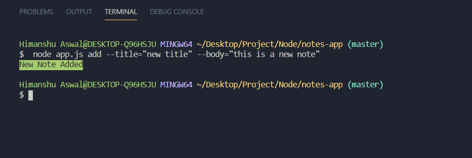
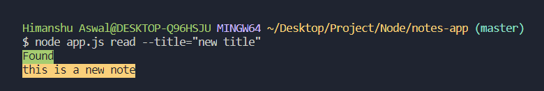
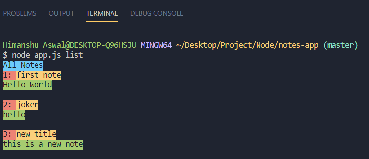
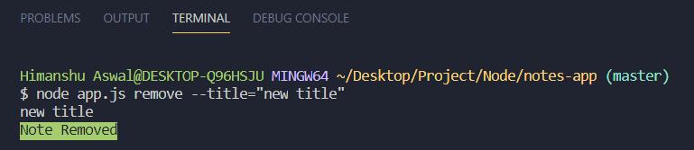
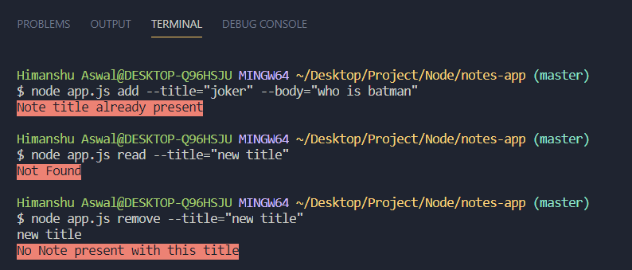

# notes-app

notes app is a cli based app to take notes.

## Setup

- Clone this repo.

```
cd notes-app
```

- Run app.js file.
- See [List of commands](#list-of-commands) for more info.

## List of commands:

- **add** _(to add new note)_
  - needs title and body

```
node app.js add --title="new title" --body="this is new title"
```



- **read** _(to read a note)_
  - needs title

```
node app.js read --title="new title"
```



- **list** _(to list all notes)_

```
node app.js list
```



- **remove** _(to remove a note)_
  - needs title

```
node app.js remove --title="new title"
```



## Error Handling


